# Airport API with AWS Elastic Beanstalk

This is a C# solution to provide a **RESTful web API** for simple airport information.

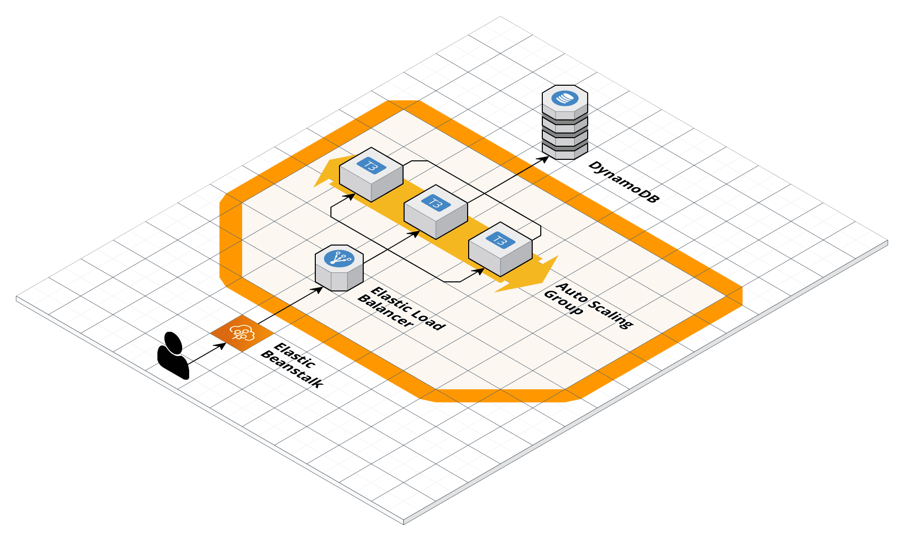

# Instruction / Guide

This guide goes through the process of setting up the AWS services required for this application.

This guide assumes that

1. you're using [Visual Studio 2022 on Windows](https://visualstudio.microsoft.com/vs/)
2. you have [.NET 6.0](https://dotnet.microsoft.com/en-us/download/dotnet/6.0) installed
3. you have [AWS Toolkit for Visual Studio](https://aws.amazon.com/visualstudio/) installed
4. you have an AWS account ([AWS Free Tier](https://aws.amazon.com/free) or otherwise)

Create a new IAM user with Administrator access

If you don't already have a IAM user with administrator access already, you should create one now.

First, login to your AWS account on the website and search for the **IAM** service on the top bar.

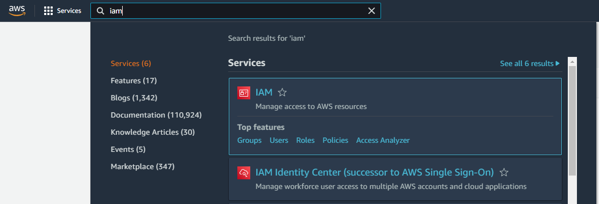

Click **Users** on the left menu
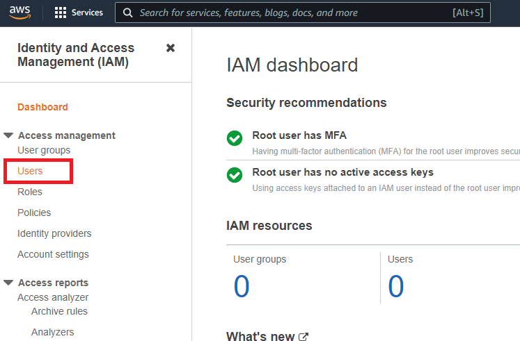

As we can see, we don't have any users yet, so click the **Add Users** button on the top right
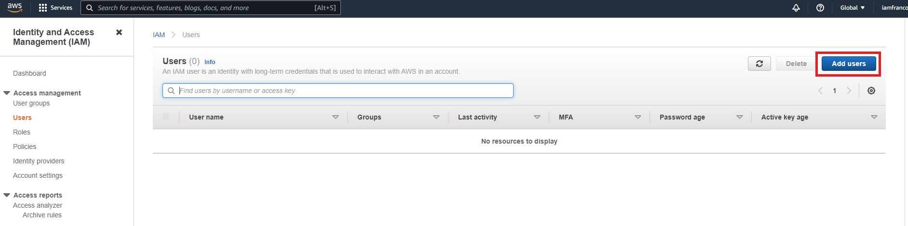

Set the **User name** as `vsuser` and tick the **Access key - Programmatic access** checkbox because we want to access this user with our Visual Studio AWS SDK. Then click the bottom right **Next: Permissions** button.

Go to the **Attach existing Policies** tab and tick the **administratorAccess** checkbox, this allows the `vsuser` user to have complete access for all AWS services, including creating DynamoDB database or Elastic Beanstalk. Then click the bottom right **Next: Tags** button.
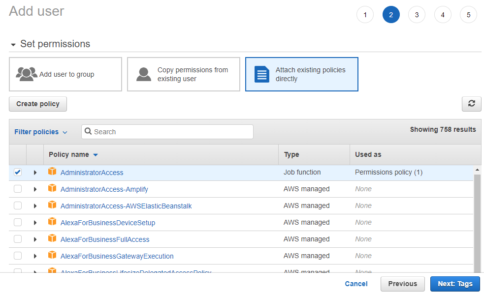

Leave the tags empty and click the **Next: Review** button.
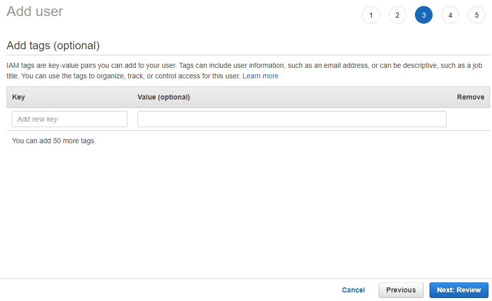

Here we can see the user being created has user name of `vsuser`, AWS access type of **Programmatic access - with an access key**, permissions summary managed policy of **AdministratorAccess**. Click **Create user** button.
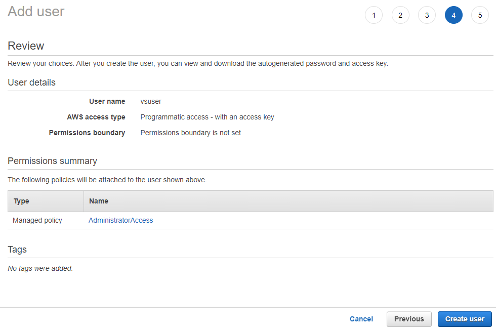

Now the new user `vsuser` has been successfully created, be sure to click the **Download .csv** button to save the credentials CSV file onto your local hard drive. We will use this CSV file later when we need to sign in to `vsuser` through the Visual Studio 2022 AWS SDK.
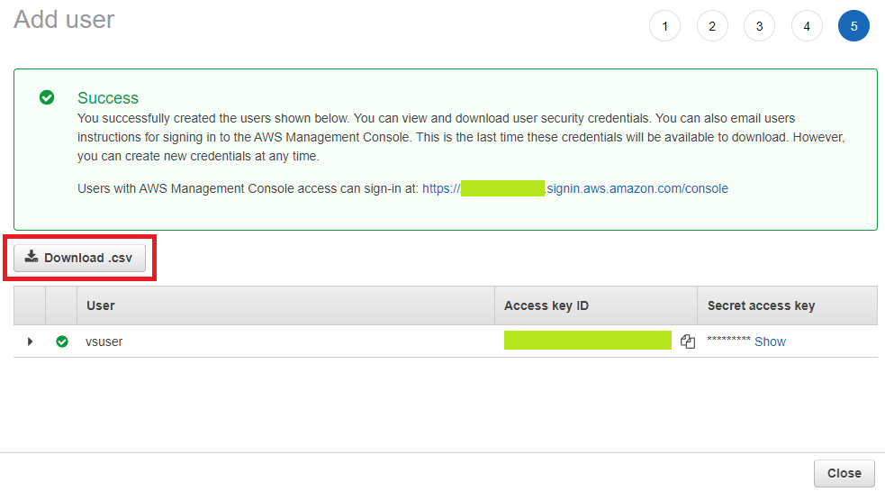

Going back to the **Users** page, we see that the new user `vsuser` has indeed been successfully created.
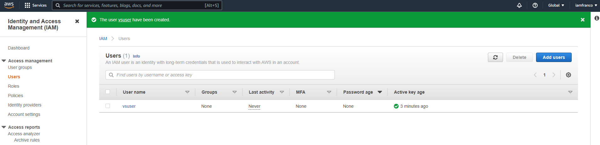

Visual Studio AWS Profile Sign In

Open up Visual Studio, if you have installed the [AWS Toolkit for Visual Studio](https://aws.amazon.com/visualstudio/) correctly, you should see this option in **View** > **AWS Explorer**
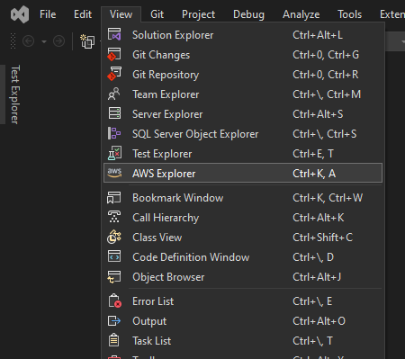

Click to open **AWS Explorer** and you should see this button (**Add AWS Credentials Profile**), click it.
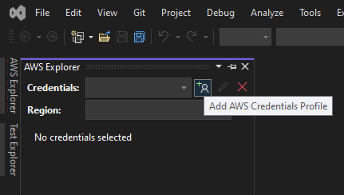

Then fill in the correct details in the pop up window:

1. Profile name, could be anything but for simplicity sake let's keep it `vsuser`
2. Import from CSV file and select the CSV file with the credentials you've downloaded in the **Create IAM user with administrator access** in the previous section
3. Set the Region to your region
4. click OK.

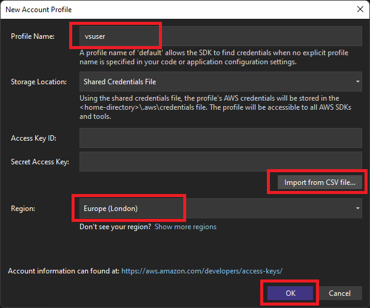

After that, the profile should be signed in to the AWS Explorer, and all the AWS services would be available through the AWS Explorer in Visual Studio.

Create new DynamoDB airports table 

