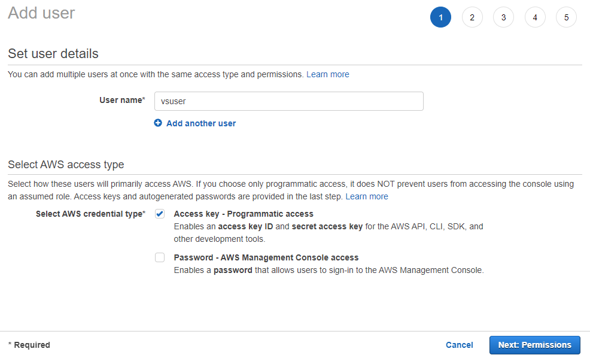

# Airport API with AWS Elastic Beanstalk

This is a C# solution to provide a **RESTful web API** for simple airport information.


# Instruction / Guide

This guide goes through the process of setting up the AWS services required for this application.

This guide assumes that

1. you're using [Visual Studio 2022 on Windows](https://visualstudio.microsoft.com/vs/)
2. you have [.NET 6.0](https://dotnet.microsoft.com/en-us/download/dotnet/6.0) installed
3. you have [AWS Toolkit for Visual Studio](https://aws.amazon.com/visualstudio/) installed
4. you have an AWS account ([AWS Free Tier](https://aws.amazon.com/free) or otherwise)
5. you have cloned this repo

<details>
<summary><span style="font-size:1.2rem">Create a new IAM user with Administrator access</span></summary>

If you don't already have a IAM user with administrator access already, you should create one now.

First, login to your AWS account on the website and search for the **IAM** service on the top bar.


Click **Users** on the left menu


As we can see, we don't have any users yet, so click the **Add Users** button on the top right


Set the **User name** as `vsuser` and tick the **Access key - Programmatic access** checkbox because we want to access this user with our Visual Studio AWS SDK. Then click the bottom right **Next: Permissions** button.


Go to the **Attach existing Policies** tab and tick the **administratorAccess** checkbox, this allows the `vsuser` user to have complete access for all AWS services, including creating DynamoDB database or Elastic Beanstalk. Then click the bottom right **Next: Tags** button.


Leave the tags empty and click the **Next: Review** button.


Here we can see the user being created has user name of `vsuser`, AWS access type of **Programmatic access - with an access key**, permissions summary managed policy of **AdministratorAccess**. Click **Create user** button.


Now the new user `vsuser` has been successfully created, be sure to click the **Download .csv** button to save the credentials CSV file onto your local hard drive. We will use this CSV file later when we need to sign in to `vsuser` through the Visual Studio 2022 AWS SDK.


Going back to the **Users** page, we see that the new user `vsuser` has indeed been successfully created.


</details>

<details>
<summary><span style="font-size:1.2rem">Visual Studio AWS Profile Sign In</span></summary>

Open up Visual Studio, if you have installed the [AWS Toolkit for Visual Studio](https://aws.amazon.com/visualstudio/) correctly, you should see this option in **View** > **AWS Explorer**


Click to open **AWS Explorer** and you should see this button (**Add AWS Credentials Profile**), click it.


Then fill in the correct details in the pop up window:

1. Profile name, could be anything but for simplicity sake let's keep it `vsuser`
2. Import from CSV file and select the CSV file with the credentials you've downloaded in the **Create IAM user with administrator access** in the previous section
3. Set the Region to your region
4. click OK.


After that, the profile should be signed in to the AWS Explorer, and all the AWS services would be available through the AWS Explorer in Visual Studio.


One thing to note is that `appsettings.Development.json` has the content:

```json
{
  "Logging": {
    "LogLevel": {
      "Default": "Information",
      "Microsoft.AspNetCore": "Warning"
    }
  },
  "AWS": {
    "Profile": "vsuser",
    "Region": "eu-west-2"
  }
}
```

where

- `AWS.Profile` of `"vsuser"` should be matching the profile name, and
- `AWS.Region` of `"eu-west-2"` should be matching your region

So if you chose a different profile name or region, be sure to adjust the `appsettings.Development.json` accordingly.

</details>

<details>
<summary><span style="font-size:1.2rem">Create new DynamoDB airports table </span></summary>

Now that the AWS Explorer has profile `vsuser` connected, it's time to create a new DynamoDB table for airports.

Before we begin, notice that the `Models/Airport.cs` class has the content:

```c#
using Amazon.DynamoDBv2.DataModel;

namespace AirportAPI.Models;

[DynamoDBTable("airports")]
public class Airport
{
    [DynamoDBHashKey("code")]
    public string? Code { get; set; }

    [DynamoDBProperty("name")]
    public string? Name { get; set; }

    [DynamoDBProperty("city")]
    public string? City { get; set; }
}
```

where the

```c#
[DynamoDBTable("airports")]
```

defines that the DynamoDB table should have the name `"airports"`, so when we create the DynamoDB table, it should have the name **airports**.

Also notice that the hash key name is `"code"` by this line in `Models/Airport.cs`

```c#
[DynamoDBHashKey("code")]
```

To create the **airports** table, open AWS Explorer, right click on **Amazon DynamoDB** and click **Create Table...**


A window pops up for creating new DynamoDB Table:

- set the **Table Name** as **airports**
- set the **Hash Key Name** as **code**, with **Hash Key Type** as **String**
- Click **Create**


Now after creating this new DynamoDB table, we can see it under the **Amazon DynamoDB** in the AWS Explorer


Double clicking on the **airports** table opens it up, and shows an empty table


Also, if open the AWS website and go to the **DynamoDB** page, you can see the **airports** table there


</details>

<details>
<summary><span style="font-size:1.2rem">Test Run the Web API locally</span></summary>

Now that DynamoDB table **airports** has been created, you should now be able to run the Web API locally and test out the endpoints on swagger.

First, click on the **AirportAPI** button to run it in debug mode.


It should open up a new page for **Swagger**, listing all the endpoints.


Sending a **GET** request to the `/api/Airport` endpoint would initially respond with **empty list of airports**, `[]`, with status code of `200`


> ## If it responds with error
>
> But if it responds with error message instead, then it's likely because some AWS configuration weren't set properly. It could be:
>
> - The AWS user (say `vsuser`) didn't have permission to access DynamoDB. Go to **IAM** service page on AWS and add the permission to have **AdministratorAccess** which would certainly grant it access to DynamoDB.
> - The AWS user did have permission to access DynamoDB, but it was not configured correctly in `appsettings.Development.json`. Go to `appsettings.Development.json` and make sure the attributes under `"AWS"` were set appropriately for the user profile, it could be the `"Profile"` not matching or the `"Region"` not matching.
> - The DynamoDB table name not matching the table name of `"airports"` specified in `Models/Airport.cs`.
>
> Or it could be something else entirely, try to resolve that before proceeding to next step.

Next, we could send a **POST** request to the `/api/Airport` endpoint to create a new airport in the DynamoDB **airports** table.

For example, sending a **POST** request with request body

```json
{
  "code": "MAN",
  "name": "Manchester Airport",
  "city": "Manchester"
}
```

would create this new airport item in the **airports** table


Next, you can try all the endpoints, they should all work as expected.

| action   | endpoint              | what it does                                                                                     |
| -------- | --------------------- | ------------------------------------------------------------------------------------------------ |
| `GET`    | `/api/Airport`        | Get a list of all airports                                                                       |
| `GET`    | `/api/Airport/{code}` | Get airport with matching airport code to `{code}`                                               |
| `POST`   | `/api/Airport`        | Create new airport, where request body should contain info (in `json` format) of new airport     |
| `PUT`    | `/api/Airport`        | Update airport, where request body should contain info (in `json` format) of the updated airport |
| `DELETE` | `/api/Airport/{code}` | Delete airport with matching airport code to `{code}`                                            |

</details>
